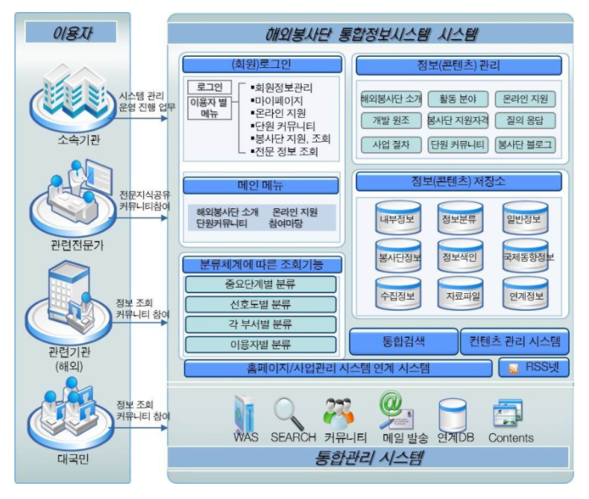

## 황준호의 IT 용어 사전

계정계

 
본연의 금융 업무 처리 시스템. 고객의 거래 데이터 자체를 다루는 영역 

업무: 계좌 개설 및 폐쇄, 입출금,이체, 외환 시스템 처리 등 
특징: 가장 핵심적인 시스템, 장애가 바로 금전적 피해로 이어짐. 필히 보수적으로 운영되는 영역 안정성이 최우선(삼중 백업) 

정보계

계정계에서 생성된 데이터를 기반으로 영업점 및 각 부서의 업무처리에 필요한, 참고해야할 기록과 통계를 관리하는 시스템. 

업무: 
1) 목적별 전문 데이터 관리: 신용평가, 여신승인,리스크관리 
2) 기업 전략을 위한 데이터관리: 수익관리, 고객관계관리, 성과관리, 위험관리, 마케팅 등 
특징: 최근 고객 중심 서비스가 주요해지며, 고객 접점 채널에 즉각적인 마케팅과 개인화가 가능하도록 빅데이터 기술이 가장 많이 활용되고 있음. 

채널계

고객 유입 채널이 다양해짐에 따라 이러한 고객들과 접하는 통로를 관리하는 시스템.

데이터 웨어하우스(DW)

데이터웨어 하우스(DW)는 기존 정보를 활용해 더 나은 정보를 제공하고, 데이터의 품질을 향상시키며, 조직의 변화를 지원하고 비용과 자원관리의 효율성을 향상시키는 것이 목적이다. 

데이터 웨어하우스의 4가지 특성 
▷ 주제지향(Subject Oriented): 
기존의 데이터베이스가 대출, 예금, 재고관리 등과 같은 '기능'이나 '업무' 처리를 중심으로 설계되는 것에 비해 데이터웨어 하우스(DW)는 고객, 거래처, 공급자, 상품 등과 같은 '주제' 중심으로 구성된다. 즉, 이용자에게 이해하기 쉬운 형태로 제공된다. 

▷ 통합(Integrated): 
기존의 운영시스템은 부서나 부문, 혹은 기관별로 일관성 없는 다량의 데이터를 중복 관리하지만, 데이터 웨어하우스(DW)는 데이터 속성의 이름, 코드의 구조, 도량형 단위 등의 일관성을 유지하며 전사적 관점에서 하나로 통합한다. 

▷ 시계열(Time Variant): 
기존의 데이터베이스는 사용자가 사용하는 현재 시간을 기준으로 최신의 값을 유지하지만, 데이터웨어 하우스(DW)는 일정 기간 수집된 데이터를 갱신 없이 보관하며 일, 월, 분기, 년 등과 같은 기간 관련 정보를 함께 저장한다. 

시계열성은 어떤 자료가 시간에 따라 변경되어야 하는 것이 아니고, 시간에 따른 변경을 항상 반영하고 있어야 함을 의미한다. 

▷ 비휘발성(Nonvolatile): 
기존의 데이터베이스에서는 추가나 삭제, 변경 등과 같은 갱신 작업이 레코드 단위로 지속적으로 발생하지만, 데이터 웨어하우스(DW) 내의 데이터는 일단 적재(loading)가 완료되면 읽기 전용 형태의 스냅 샷 데이터로 존재하게 된다. 

ETL

ETL이란 데이터 웨어하우스 구축 시 데이터를 운영 시스템에서 추출하여 가공(변환, 정제)한 후 데이터 웨어하우스(DW)에 적재하는 모든 과정을 말한다. 일반적으로 발생하는 데이터 변환에는 필터링, 정렬, 집계, 데이터 조인, 데이터 정리, 중복 제거 및 데이터 유효성 검사 등의 다양한 작업이 포함된다. 

▷ Extract: 하나 또는 그 이상의 데이터 원천들로 부터 데이터 획득 
▷ Transform: 데이터 클렌징, 형식 변환 및 표준화, 통합 또는 다수 애플리케이션에 내장된 비즈니스룰 적용 등 
▷ Load: 변형 단계의 처리가 완료된 데이터를 특정 목표 시스템에 적재 

ETCL

Extraction(추출) 
다수의 소스시스템으로 부터 데이터를 추출하는 기능 

Transformation(변환) 
DW내 표준화 규칙에 의거 데이터 변환 
소스시스템 데이터를 DW 시스템 모델을 형태로 변경 

Cleansing(정제) 

가상화서버

가상화가 대세. -> 예전에는 일부만 가상화를 사용했지만 이제 금융권도 코어부분도 가상화서버에 올리고 있다. 

개발서버, 테스트서버, 운용서버 

이렇게 한 프로젝트에 여러 서버들이 필요한데, 이러한 서버를 구축하는데 6주걸린다. 

하지만, 가상화를 이용하면 하루면 끝. 

기존에 가상화서비스의 보안과 성능의 문제로 일부만 가상화서버를 사용했던 금융권이 

최근 기술 제약의 극복으로 많은 부분을 가상화로 전환하려는 움직임이 활발하기 때문에 

가상화 서버에 대한 지식과 기술은 필수적이다. 

화이트 바이저

??

DB와 DBMS의 차이

DB는 data들을 얻기위해 효율적으로 저장된 집합체이고. 
DBMS는 이러한 DB를 쉽게 만들고 관리하는 여러가지 프로그램들이 모인 하나의 시스템을 뜻한다. 데이터베이스 관리시스템. 

IPO

Input -> Processing -> Output

DevOps

데브옵스(DevOps)는 소프트웨어의 개발(Development)과 운영(Operations)의 합성어로서, 소프트웨어 개발자와 정보기술 전문가 간의 소통, 협업 및 통합을 강조하는 개발 환경이나 문화를 말한다.

시스템 구성도

 

PM & PL

Project Manager : 작전 담당 중대장 역할 
Project Leader : 분대장 역할 
피라미드 구조의 관리에서  

아키텍터

소프트웨어 아키텍트(software architect)는 전문가로 간주되는 소프트웨어 개발자로서, 
고수준의 설계적 결정을 수행하고 소프트웨어 코딩 표준, 도구, 플랫폼을 포함한 기술 표준을 지시한다.

아키텍처 직군

SW아키텍트 
위에있음. 
DA: Data Architect 
비즈니스나 프로젝트 전체의 데이터와 관련된 아키텍처를 담당합니다. 
회사에 어떠한 데이터들이 있는지, 그리고 어떤 데이터가 필요한지 등에 대해 종합적으로 분석하고 어떻게 데이터를 접근-처리-관리할 것인지에 대해 설계합니다.
TA: Technical Architect 
비지니스를 운영하기 위한 IT 시스템의 환경을 설계하는 역할을 주로 담당합니다.(네트워크 부터 서버, 소프트웨어 등을 어떻게 구성할 것인지에 대한 설계를 수행)
https://www.stevenjlee.net/2020/06/04/%EC%9D%B4%ED%95%B4%ED%95%98%EA%B8%B0-%EC%95%84%ED%82%A4%ED%85%8D%ED%8A%B8-architect-ea-ba-sa-ta-aa-da/

프로젝트관리 직군

프로젝트 관리 
개발은 아웃소싱하고 그 프로젝트를 관리하는 직군. 
소프트웨어 품질관리 
개발된 소프트웨어의 품질을 끌어올리는 역할. 
정보보호 

Client와 Server

  ㅇ 클라이언트 (Client) 
     - 영어 뜻 자체로는 고객을 의미 
        . 클라이언트는 1 이상의 서버 제공 서비스를 사용하는 소비자의 개념 
     - 클라이언트/서버 모델에서,   
        . 네트워크를 이용하여 서버(Server)측에 서비스 요청을 의뢰하는 측 
           .. 웹 브라우저, 데스크톱 프로그램, 모바일 앱, 다른 서버에 요청을 보내는 서버 등 

  ㅇ 서버 (Server) 
     - 클라이언트들이 요구하는 각종 서비스를 제공하는 측 
        . 특정 역할에 특화된 것 
     - 클라이언트/서버 모델에서, 
        . 네트워크 상에 구현된 하드웨어 또는 소프트웨어로써, 서비스의 요청을 받는 측 

=> 한 머신은 클라이언트이자 동시에 서버가 될 수 있다. 

하이퍼 바이저 & 도커

https://m.blog.naver.com/PostView.nhn?blogId=tommybee&logNo=221141977081&proxyReferer=https:%2F%2Fwww.google.com%2F

1일차 과제

1. DB vs DBMS 정의, 사례, 차이점

DB란 Database로, 여러사람이 효율적으로 공유하고 사용할 목적으로 만들어진 data들의 집합이다. 
DBMS란 Database Management System으로, DB를 효율적으로 생산하고 관리하기 위해 만들어진 소프트웨어다. 
예를 들어 한 기업의 내부에 고객DB, 생산DB, 판매DB 등이 존재한다면 여기서 각각의 DB가 데이터베이스이고 
이를 관리하는 오라클이 DBMS이다. 
DBMS에는 계층형, 네트워크형, 관계형, NoSQL형이 존재한다. 
각각 {IBM의 IMS}, {DBTG}, {Oracle, MySQL}, {MongoDB, MariaDB} 

2. RDBMS 정의 및 개념, R이란?

관계형 데이터 모델에 기초를 둔 데이터베이스가 RDB이고 이러한 RDB를 수정 관리하는 소프트웨어가 RDBMS이다. 
여기서 R은 Relational의 의미다. 
관계란 같은 속성을 지닌 튜플들의 모임으로 정의된다. 

3. SQL Syntax Diagram

4. Connection vs Session

5. 데이터 사이에 , 를 삽입하는 예제.

SELECT EMPNO||','||ENAME||','||JOB||','||MGR||','||HIREDATE||','||SAL||','||COMM||','||DEPTNO FROM EMP;

6. SELECT * FROM TAB; 용도

내가 사용할 수 있는 테이블의 리스트를 볼 수 있다.

2일차 과제

1. SYSDATE & SYSTIMESTAMP

select to_char(SYSTIMESTAMP, 'YY-MM-DD HH:MM:SS/FF2') FROM dual; 
select to_char(SYSTIMESTAMP, 'YY-MM-DD HH:MM:SS/FF3') FROM dual; 

+ sysdate 시간 안나오는 이유 
-> default format이 'RR/MM/DD'여서 연도,월,일 만 나왔던 것이었따..!! 
-> SELECT value FROM V$NLS_PARAMETERS WHERE parameter = 'NLS_DATE_FORMAT'; 
-> ALTER SESSION SET NLS_DATE_FORMAT = 'YYYY/MM/DD HH:MI:SS'; 이를 통해 포맷 변경 가능 

